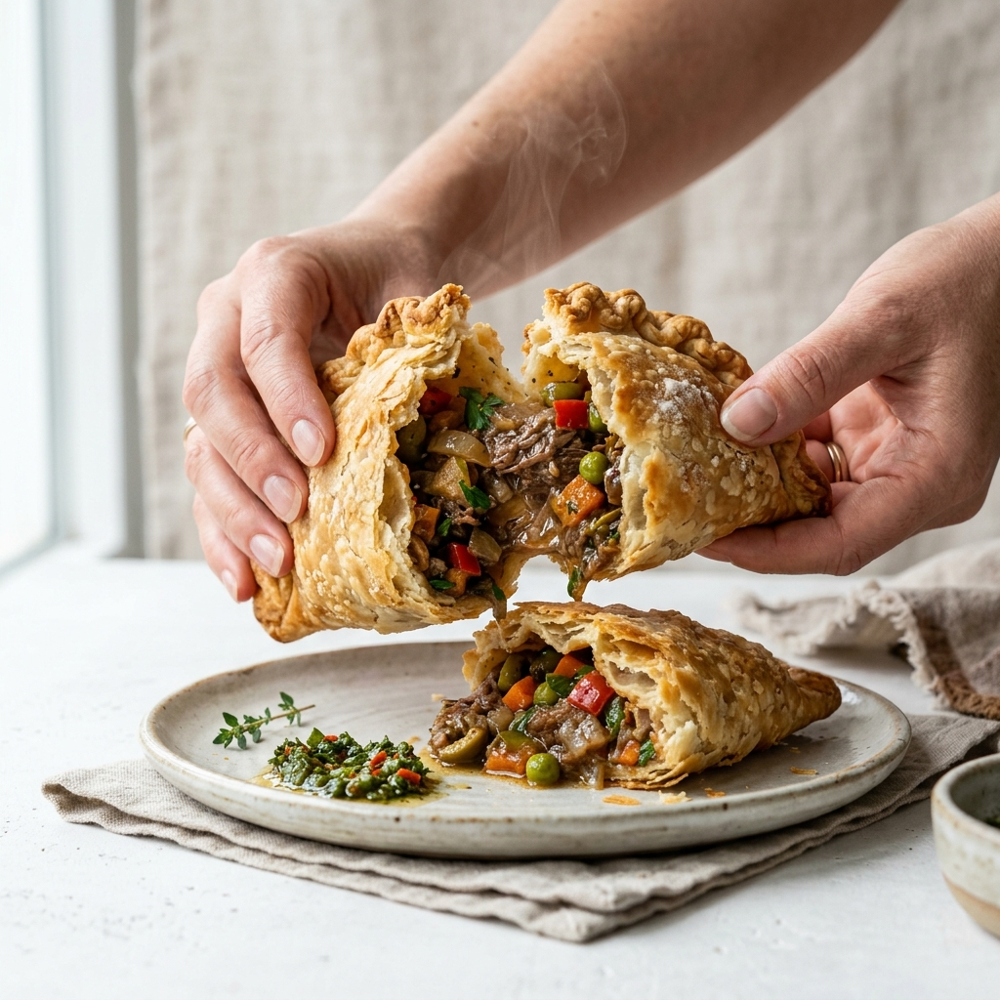

# 🔧 CORRECCIONES DE CÓDIGO - LISTAS PARA COPIAR/PEGAR

## 1. ACTUALIZAR HEAD (Tipografía + Performance)

### ❌ REEMPLAZAR ESTO:
```html
<link rel="stylesheet" href="https://fonts.googleapis.com/css2?family=Outfit:wght@300;400;700;900&display=swap">
```

### ✅ CON ESTO:
```html
<!-- Preconnect a Google Fonts -->
<link rel="preconnect" href="https://fonts.googleapis.com">
<link rel="preconnect" href="https://fonts.gstatic.com" crossorigin>

<!-- Poppins (Headings) + Inter (Body) -->
<link rel="preload" as="style" href="https://fonts.googleapis.com/css2?family=Poppins:wght@600;700;800;900&family=Inter:wght@400;500;600&display=swap">
<link rel="stylesheet" href="https://fonts.googleapis.com/css2?family=Poppins:wght@600;700;800;900&family=Inter:wght@400;500;600&display=swap">
```

---

## 2. AGREGAR VARIABLES CSS PARA COLORES

### ✅ AGREGAR DESPUÉS DE `<style>`:

```css
:root { 
  /* Primarios según Manual */
  --primary: #ea542d;
  --primary-dark: #cc4927;
  --primary-light: #f17a56;
  
  /* Acentos */
  --accent-yellow: #f7e36d;
  --accent-pink: #fe4e6e;
  --accent-purple: #613864;
  
  /* Grises mejorados (contraste WCAG) */
  --text-primary: #1a1a1a;      /* Era #000 */
  --text-secondary: #4b5563;     /* Era #999 */
  --text-muted: #6b7280;         /* Para captions */
  
  --bg-light: #fef9f7;           /* Fondo cálido */
  --border-light: #f0e8e3;       /* Bordes suaves */
}

body {
  font-family: 'Inter', 'Outfit', sans-serif;  /* Inter en lugar de Outfit */
  color: var(--text-primary);
  overflow-x: hidden;
}

/* Headings con Poppins */
h1, h2, h3, h4, h5, h6 {
  font-family: 'Poppins', sans-serif;
  font-weight: 700;
  letter-spacing: -0.02em;
}

.font-brand-bold {
  font-family: 'Poppins', sans-serif;
  font-weight: 800;
}

/* Párrafos mejorados */
p {
  color: var(--text-secondary);
  line-height: 1.6;
}

/* Botones con mejor hover */
.btn-main {
  border-radius: 30px;
  transition: all 0.3s cubic-bezier(0.175, 0.885, 0.32, 1.275);
  cursor: pointer;
}

.btn-main:hover {
  background-color: var(--primary-dark) !important;
  transform: translateY(-2px);
  box-shadow: 0 12px 24px rgba(234, 84, 45, 0.3);
}

.btn-main:active {
  transform: scale(0.98);
}

/* Focus states (WCAG) */
button:focus-visible,
a:focus-visible {
  outline: 3px solid var(--primary);
  outline-offset: 2px;
}

/* Mejora de contraste de links */
a {
  color: var(--primary);
  transition: opacity 0.2s;
}

a:hover {
  opacity: 0.8;
}
```

---

## 3. REEMPLAZAR WHATSAPP PLACEHOLDER

### ❌ BUSCA Y REEMPLAZA:
```html
<a href="https://wa.me/tus_datos"
```

### ✅ CON:
```html
<a href="https://wa.me/573001234567"
```

**⚠️ NOTA:** Reemplaza `573001234567` con el número real de WhatsApp en formato internacional (57 = Colombia)

---

## 4. ACTUALIZAR LINKS SOCIALES (INSTAGRAM, ETC)

### ❌ ACTUAL (Líneas 130, 258):
```html
<a href="#" class="...">Instagram</a>
<a href="#" class="...">WA</a>
```

### ✅ CORRECTO:
```html
<!-- Línea 130 (Mobile Menu) -->
<a href="https://instagram.com/benditaempanada" target="_blank" rel="noopener noreferrer" class="text-primary font-brand-bold uppercase tracking-widest text-xs hover:opacity-70 transition-opacity">
  Instagram
</a>
<a href="https://wa.me/573001234567" target="_blank" rel="noopener noreferrer" class="text-primary font-brand-bold uppercase tracking-widest text-xs hover:opacity-70 transition-opacity">
  WhatsApp
</a>

<!-- Línea 258 (Footer) -->
<a href="https://instagram.com/benditaempanada" target="_blank" rel="noopener noreferrer" class="hover:text-primary transition-colors">
  Instagram
</a>
<a href="https://wa.me/573001234567" target="_blank" rel="noopener noreferrer" class="hover:text-primary transition-colors">
  WhatsApp
</a>
```

---

## 5. AGREGAR ARIA LABELS (Accesibilidad)

### ❌ BOTÓN MENÚ (Línea 109):
```html
<button onclick="toggleMobileMenu()" class="md:hidden text-primary p-2">
  <span id="menu-icon" class="material-symbols-outlined text-3xl">menu</span>
</button>
```

### ✅ CON ARIA:
```html
<button 
  onclick="toggleMobileMenu()" 
  class="md:hidden text-primary p-3 hover:bg-orange-50 rounded-full transition"
  aria-label="Abrir menú de navegación"
  aria-expanded="false"
  aria-controls="mobile-menu">
  <span id="menu-icon" class="material-symbols-outlined text-3xl">menu</span>
</button>
```

### ❌ CERRAR MENÚ (Línea 119):
```html
<button onclick="toggleMobileMenu()" class="absolute top-6 right-6 text-zinc-400 hover:text-primary transition-colors">
  <span class="material-symbols-outlined text-3xl">close</span>
</button>
```

### ✅ CON ARIA:
```html
<button 
  onclick="toggleMobileMenu()" 
  class="absolute top-6 right-6 text-zinc-400 hover:text-primary transition-colors p-2"
  aria-label="Cerrar menú"
  aria-controls="mobile-menu">
  <span class="material-symbols-outlined text-3xl">close</span>
</button>
```

---

## 6. AGREGAR INDICADORES AL HERO SLIDER

### ✅ AGREGAR DESPUÉS DE `</div>` (línea 165):
```html
                </div>
                <!-- AGREGAR ESTOS PUNTOS -->
                <div class="flex justify-center gap-2 mt-6 md:mt-8">
                  <button 
                    class="w-3 h-3 rounded-full bg-primary transition-all duration-300 hover:bg-primary-dark" 
                    onclick="goToSlide(0)"
                    aria-label="Diapositiva 1"
                    aria-current="true">
                  </button>
                  <button 
                    class="w-3 h-3 rounded-full bg-primary/30 transition-all duration-300 hover:bg-primary-dark" 
                    onclick="goToSlide(1)"
                    aria-label="Diapositiva 2">
                  </button>
                  <button 
                    class="w-3 h-3 rounded-full bg-primary/30 transition-all duration-300 hover:bg-primary-dark" 
                    onclick="goToSlide(2)"
                    aria-label="Diapositiva 3">
                  </button>
                </div>
            </div>
```

---

## 7. MEJORAR MENSAJE DE CARRUSEL (línea 209-212)

### ❌ ACTUAL:
```html
<div class="flex items-center justify-center gap-3 mb-10 text-zinc-300 text-[10px] font-brand-bold tracking-[0.4em] uppercase">
  <svg class="w-5 h-5 animate-pulse" fill="none" stroke="currentColor" viewBox="0 0 24 24"><path stroke-linecap="round" stroke-linejoin="round" stroke-width="2" d="M17 8l4 4m0 0l-4 4m4-4H3"></path></svg>
  Desliza para ver más
</div>
```

### ✅ MEJORADO (más visible):
```html
<div class="flex items-center justify-center gap-3 mb-8 text-primary/60 text-[11px] font-brand-bold tracking-[0.4em] uppercase md:hidden">
  <span class="material-symbols-outlined text-sm animate-bounce">touch_app</span>
  <span>Toca y arrastra</span>
</div>
```

---

## 8. MEJORAR ALT TEXT DE IMÁGENES

### ❌ ACTUAL (Línea 162-164):
```html



```

### ✅ MEJOR (Más descriptivo):
```html


```

---

## 9. ACTUALIZAR FUNCIÓN toggleMobileMenu() PARA ARIA

### ✅ EN JAVASCRIPT (línea ~540), REEMPLAZAR:
```javascript
function toggleMobileMenu() {
    const menu = document.getElementById('mobile-menu');
    const overlay = document.getElementById('mobile-overlay');
    if (menu && overlay) {
        menu.classList.toggle('mobile-menu-active');
        overlay.classList.toggle('overlay-active');
        document.body.style.overflow = menu.classList.contains('mobile-menu-active') ? 'hidden' : 'auto';
    }
}
```

### CON:
```javascript
function toggleMobileMenu() {
    const menu = document.getElementById('mobile-menu');
    const overlay = document.getElementById('mobile-overlay');
    const menuBtn = document.querySelector('[aria-controls="mobile-menu"]');
    
    if (menu && overlay) {
        const isOpen = menu.classList.toggle('mobile-menu-active');
        overlay.classList.toggle('overlay-active');
        document.body.style.overflow = isOpen ? 'hidden' : 'auto';
        
        // Actualizar ARIA
        if (menuBtn) {
            menuBtn.setAttribute('aria-expanded', isOpen ? 'true' : 'false');
        }
    }
}
```

---

## 10. AGREGAR FUNCIÓN goToSlide()

### ✅ AGREGAR DESPUÉS DE setupCarousel() (línea ~340):
```javascript
// Hero Slider Navigation
let currentSlide = 0;
const slides = document.querySelectorAll('.slider-img');

function goToSlide(index) {
    if (slides.length === 0) return;
    
    // Remover clase active de slide anterior
    slides[currentSlide].classList.replace('active-slider', 'hidden-slider');
    
    // Actualizar índice
    currentSlide = index % slides.length;
    
    // Agregar clase active al nuevo slide
    slides[currentSlide].classList.replace('hidden-slider', 'active-slider');
    
    // Actualizar buttons ARIA
    document.querySelectorAll('[onclick*="goToSlide"]').forEach((btn, i) => {
        btn.setAttribute('aria-current', i === currentSlide ? 'true' : 'false');
        btn.classList.toggle('bg-primary', i === currentSlide);
        btn.classList.toggle('bg-primary/30', i !== currentSlide);
    });
}

// Auto-rotate cada 5 segundos
if (slides.length > 0) {
    setInterval(() => {
        goToSlide(currentSlide + 1);
    }, 5000);
}
```

---

## 11. MEJORAR CONTRASTE DE TEXTO

### ❌ PROBLEMA (Línea 153):
```html
<p class="text-zinc-500">  <!-- Muy pálido -->
```

### ✅ CAMBIAR A:
```html
<p class="text-zinc-600">  <!-- Mejor contraste -->
```

### APLICAR A TODOS LOS TEXTOS SECUNDARIOS:
- Reemplazar `text-zinc-400` → `text-zinc-500` o `text-zinc-600`
- Reemplazar `text-zinc-500` → `text-zinc-600` o `text-zinc-700`
- Reemplazar `text-zinc-300` → `text-zinc-400`

---

## 12. SISTEMA DE BOTONES MEJORADO

### ✅ AGREGAR ESTA CSS:
```css
/* Botón Primary (Acción principal) */
.btn-primary {
  @apply bg-primary text-white px-8 py-4 rounded-full font-bold
         shadow-lg shadow-primary/30 hover:bg-primary-dark
         active:scale-95 transition-all duration-200
         focus-visible:outline-3 focus-visible:outline-offset-2 focus-visible:outline-primary
         cursor-pointer;
}

/* Botón Secondary (Acción secundaria) */
.btn-secondary {
  @apply bg-white text-primary px-8 py-4 rounded-full font-bold
         border-2 border-primary hover:bg-orange-50
         active:scale-95 transition-all duration-200
         cursor-pointer;
}

/* Botón Filter (Categorías) */
.btn-filter {
  @apply px-6 py-3 rounded-full font-bold text-sm transition-all duration-200
         cursor-pointer focus-visible:outline-2 focus-visible:outline-offset-2;
}

.btn-filter.active {
  @apply bg-primary text-white shadow-lg shadow-primary/30;
}

.btn-filter:not(.active) {
  @apply bg-white text-zinc-600 border border-zinc-200 hover:border-primary;
}
```

---

## 13. ACTUALIZAR JSON-LD SEO (Línea 57-90)

### ✅ COMPLETAR CAMPOS VACÍOS:
```json
{
  "@context": "https://schema.org",
  "@type": "FoodEstablishment",
  "name": "Bendita Empanada",
  "image": "https://benditaempanada.com/assets/hero.png",
  "@id": "https://benditaempanada.com",
  "url": "https://benditaempanada.com",
  "telephone": "+573001234567",  // ✅ COMPLETAR
  "address": {
    "@type": "PostalAddress",
    "streetAddress": "Calle 123 #45-67",  // ✅ COMPLETAR
    "addressLocality": "Medellín",
    "addressRegion": "Antioquia",
    "postalCode": "050001",  // ✅ COMPLETAR
    "addressCountry": "CO"
  },
  "openingHoursSpecification": {
    "@type": "OpeningHoursSpecification",
    "dayOfWeek": ["Monday", "Tuesday", "Wednesday", "Thursday", "Friday", "Saturday"],
    "opens": "08:00",
    "closes": "20:00"
  },
  "menu": "https://benditaempanada.com/#sabores",
  "servesCuisine": ["Colombian", "Artisanal", "Gourmet"],
  "priceRange": "$$",
  "sameAs": [
    "https://instagram.com/benditaempanada",
    "https://wa.me/573001234567"
  ],
  "contact": {
    "@type": "ContactPoint",
    "contactType": "Customer Support",
    "telephone": "+573001234567"
  }
}
```

---

## 14. OPTIMIZAR IMAGEN HERO (Responsive + Performance)

### ✅ REEMPLAZAR (Línea 161-165):
```html
<!-- ❌ ACTUAL -->
<div class="relative w-full aspect-square image-rounded bg-zinc-50 shadow-2xl overflow-hidden" id="hero-slider">
  

<!-- ✅ OPTIMIZADO -->
<div class="relative w-full aspect-square image-rounded bg-zinc-100 shadow-2xl overflow-hidden" id="hero-slider">
  
```

---

## CHECKLIST DE IMPLEMENTACIÓN

```
[ ] 1. Cambiar tipografía (Poppins + Inter)
[ ] 2. Agregar variables CSS de colores
[ ] 3. Reemplazar WhatsApp placeholder
[ ] 4. Actualizar links sociales
[ ] 5. Agregar ARIA labels
[ ] 6. Agregar slide indicators
[ ] 7. Mejorar carrusel hint
[ ] 8. Mejorar alt text
[ ] 9. Actualizar toggleMobileMenu()
[ ] 10. Agregar goToSlide()
[ ] 11. Mejorar contraste de texto
[ ] 12. Agregar sistema de botones
[ ] 13. Completar JSON-LD
[ ] 14. Optimizar imágenes
[ ] 15. Test en mobile (375px), tablet (768px), desktop (1440px)
[ ] 16. Verificar focus states (Tab navigation)
[ ] 17. Verificar contraste (WCAG AA)
[ ] 18. Lighthouse audit
```

---

**Tiempo estimado:** 3-4 horas para todos los cambios  
**Mejora esperada:** Lighthouse +25-30 puntos, WCAG AA compliance
